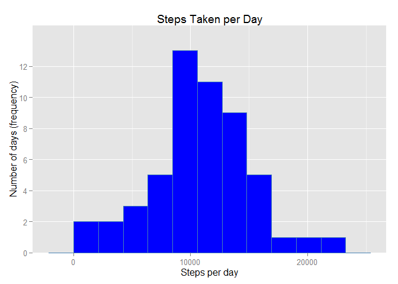
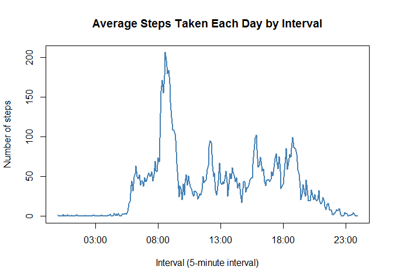
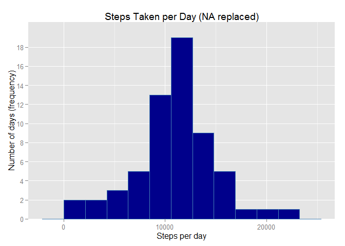
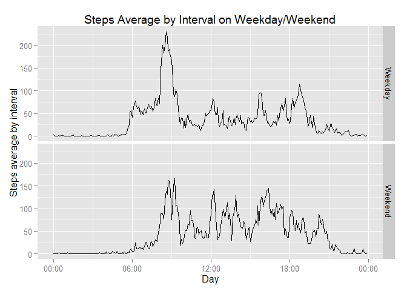

# Reproducible Research: Peer Assessment 1
 
*By Aljaziri @GitHub.com*  
*Assignment Date: 17 Aug 2015* 
___________________________________________________________________________________________

### Pre-analysis Tasks
Set Working directory to the directory in which both code & raw data located. For example in my machine I run:
*setwd("C:/Users/jalil/Documents/GitHub/RepData_PeerAssessment1")*

Then load the following required libraries (please ignore any warning about R version):

```r
library(knitr)
```

```
## Warning: package 'knitr' was built under R version 3.1.3
```

```r
library(plyr)
```

```
## Warning: package 'plyr' was built under R version 3.1.3
```

```r
library(scales)
```

```
## Warning: package 'scales' was built under R version 3.1.3
```

```r
library(ggplot2)
```

```
## Warning: package 'ggplot2' was built under R version 3.1.3
```

In case you get the following error when running the code:
*rcpp_warning_recorder' not found*
Then this means you have outdated library and you need to run the following in the command prompt:
*install.packages("Rcpp")*
This will install the latest version of the package.


Due to ruining several similar scripts, you might get error of about image not available. This is caching problem that can be solved by deleting images in the *PA1_template_files/figure-html* folder, before running this code.


## Loading and preprocessing the data

In case it wasn't unzipped, we unzip the **activity.zip** file provided in the assignment description.
Then we load it into a variable called **activity**.

```r
if(!file.exists('activity.csv')){ 
        unzip('activity.zip') 
        }
activity <- read.csv('activity.csv')
```

**Convert date and time to the proper format suitable for ploting**

We do this using *POSIXct* function :

```r
activity$date <- as.POSIXct(activity$date,format='%Y-%m-%d',tz='GMT')
time <- formatC(activity$interval / 100, 2, format='f')
activity$time <- as.POSIXct(time,format='%H.%M',tz='GMT')
activity$date_time <- as.POSIXct(paste(activity$date, time),
                                 format='%Y-%m-%d %H.%M',
                                 tz='GMT')
```


## What is mean total number of steps taken per day?

For this part of the assignment, you can ignore the missing values in the dataset.

**1. Calculate the total number of steps taken per day **  

We do this using *ddply* function :

```r
total_steps <- ddply(activity, ~date, summarise, steps = sum(steps))
```

**2. Plot a histogram of total number of steps per day **  

We do this using *ggplot* library.
*X-axis* is for steps per day
*X-axis* is for how many days are on each frequency

Histogram is simplified by calculating the binwidth range of the steps between MAX and MIN using unit of 10 steps.

```r
binwidth <- ( max(range(total_steps$steps,na.rm = TRUE))
                - min(range(total_steps$steps,na.rm = TRUE)) 
                )/10
```

We then plot the histogram with the following parameters :

```r
g1 <- ggplot(total_steps, aes(steps))
g1 <- g1 + geom_histogram(fill = "blue",
                          color="steelblue",
                          binwidth = binwidth) 
g1 <- g1 + labs(title = "Steps Taken per Day")
g1 <- g1 + xlab("Steps per day") 
g1 <- g1 + ylab("Number of days (frequency)")
g1 <- g1 + scale_y_discrete(breaks = seq(0,20,2))
g1
```

 

**3. Calculate the mean and median of total number of steps per day **  

We do this using *mean* and *median* functions :

```r
mean_steps <- format(mean(total_steps$steps,na.rm = TRUE), 
                     digits = 0,
                     scientific = FALSE)
median_steps <- format(median(total_steps$steps,na.rm = TRUE),
                       digits = 0,
                       scientific = FALSE)
```

So the average is **10766** steps and the median is **10765** steps.


## What is the average daily activity pattern?

**1. Make a time series plot (i.e. type = "l") of the 5-minute interval (x-axis) and the average number of steps taken, averaged across all days (y-axis)**

We use *split* function to split data by *interval*
Then use *sapply* function to calculate the *interval_mean*

```r
interval <- split(activity$steps, activity$interval)
interval_mean <- sapply(interval, mean, na.rm = TRUE)
```

After that we use *plot* function to plot time series of the **interval_mean** data series :

```r
plot(unique(activity$time),
     interval_mean,
     main = "Average Steps Taken Each Day by Interval",
     xlab = "Interval (5-minute interval)",
     ylab = "Number of steps",
     type = "l",
     lwd = 2,
     col = "steelblue")
```

 


**2. Which 5-minute interval, on average across all the days in the dataset, contains the maximum number of steps?**

We calculate the maximum of steps by interval. Then we identify the index of the value, and take the value of this interval.

```r
max_Interval <- max(interval_mean)
max_Index <- (which(interval_mean == max_Interval))
Interval_value <- activity$interval[max_Index]
Hour_value <- activity$time[max_Index]
```

The 5-minute interval containing the maximum of steps on average across all the days is the **104**th row, with an interval value of **835** (**08:35**), with an average of **206** steps.


## Imputing missing values

**1. Calculate and report the total number of missing values in the dataset (i.e. the total number of rows with NA's)**

we use the *is.na* function to calculate the NA rows :

```r
NA_number <- sum(as.numeric(is.na(activity$steps)))
```
In that data set, there are **2304** NA values.

**2. Devise a strategy for filling in all of the missing values in the dataset. The strategy does not need to be sophisticated. For example, you could use the mean/median for that day, or the mean for that 5-minute interval, etc**

To keep the set values we replace NA values by the 5-minutes interval average. Then we calculate the mean steps of the modified interval vector :

```r
interval_mean <- tapply(activity$steps, activity$interval, mean, na.rm = TRUE)
```

**3. Create a new dataset that is equal to the original dataset but with the missing data filled in**  

We create a new copy of the original dataset to manipulate the NA values and add the steps median vector :

```r
activity_2 <- activity
activity_2$steps.median <- interval_mean
```

Then we replace all NA values by the mean corresponding value :

```r
for (i in which(is.na(activity_2))) {activity_2[i,1] <- activity_2[i,6]}
```

**4. Make a histogram of the total number of steps taken each day and Calculate and report the mean and median total number of steps taken per day. Do these values differ from the estimates from the first part of the assignment? What is the impact of imputing missing data on the estimates of the total daily number of steps ?**  

We calculate total steps per day :

```r
total_steps_2 <- ddply(activity_2, ~date, summarise, steps = sum(steps))
```

Then we calculate the binwidth of day range with unit of 10 steps :

```r
binwidth_2 <- ( max(range(total_steps_2$steps,na.rm = TRUE))
                - min(range(total_steps_2$steps,na.rm = TRUE)) 
                )/10
```

Then we plot the new histogram with NA replaced :

```r
g2 <- ggplot(total_steps_2, aes(steps))
g2 <- g2 + geom_histogram(fill = "darkblue",
                          color="steelblue",
                          binwidth = binwidth_2) 
g2 <- g2 + labs(title = "Steps Taken per Day (NA replaced)")
g2 <- g2 + xlab("Steps per day") 
g2 <- g2 + ylab("Number of days (frequency)")
g2 <- g2 + scale_y_discrete(breaks = seq(0,20,2))
g2
```

 

We calculate the new value of both median and mean :

```r
mean_steps_2 <- format(mean(total_steps_2$steps,na.rm = TRUE), 
                     digits = 0,
                     scientific = FALSE)
median_steps_2 <- format(median(total_steps_2$steps,na.rm = TRUE),
                         digits = 0,
                         scientific = FALSE)
```

The average is **10766** steps and the median is **10766** steps.

We notice that the average is neutral (previous value: **10766**), on median it's insignificant (previous value: **10765**).


## Are there differences in activity patterns between weekdays and weekends?


**1. Create a new factor variable in the dataset with two levels - "weekday" and "weekend" indicating whether a given date is a weekday or weekend day**
  
First we create new copy of the date variable :

```r
activity_2$day_type <- activity_2$date
```

Then use the *weekdays()* function to split days in two different classes (weekday and weekend).
We create a *Weeksplit* function to convert *day_type* into a two-classes variable :

```r
weeksplit <- function(date) {
        day <- weekdays(date)
        if (day %in% c("Saturday", "Sunday")) 
        return("Weekend") else return("Weekday")
        }
```

Then we applied the same created function on the *day_type* variable :

```r
activity_2$day_type <- sapply(activity_2$date, FUN = weeksplit)
```

**2. Make a panel plot containing a time series plot (i.e. type = "l") of the 5-minute interval (x-axis) and the average number of steps taken, averaged across all weekday days or weekend days (y-axis). See the README file in the GitHub repository to see an example of what this plot should look like using simulated data**

We first aggregate steps by factoring the *day_type* variable :

```r
steps_avg <- aggregate(steps ~ time + day_type, data = activity_2, mean)
```

Then we plot the time series :

```r
g3 <- ggplot(steps_avg, aes(time, steps))
g3 <- g3 + geom_line() 
g3 <- g3 + labs(title = "Steps Average by Interval on Weekday/Weekend")
g3 <- g3 + xlab("Day") 
g3 <- g3 + ylab("Steps average by interval")
g3 <- g3 + facet_grid(day_type ~ .)
g3 <- g3 + scale_x_datetime(labels = date_format(format = "%H:%M"))
g3
```

 

By looking at the above plot, we notice that activity patterns between weekdays and weekends are slightly different.

There is an **activity peak** in the beginning of a _regular weekday_.


